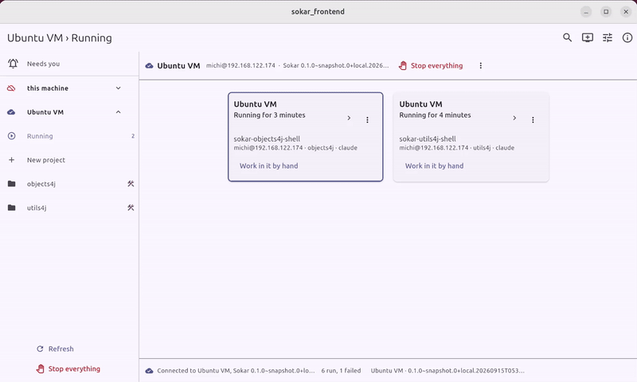

# sokar-frontend

> **Early bird - work in progress.** Sokar is not stable yet: until release 1.0.0, its code, commands
> and file formats can change without notice.

The desktop interface for [Sokar](https://github.com/sokar-ai/sokar), on Linux.

Sokar runs AI coding agents in locked-down containers: no network except what a project declares, no
credential the agent can read, and nothing leaves the machine without somebody approving it. This
interface does what Sokar's command line does, on this computer and on machines reached over ssh,
without a terminal.

**Documentation: [sokar-ai.github.io/frontend](https://sokar-ai.github.io/frontend/)**, the interface's chapter of all of Sokar's documentation.

## Install

From the same package repository as Sokar itself: `sokar-frontend`, for Debian, Ubuntu and Fedora.
How to add the repository, and the first steps after installing, are on the
[chapter's page](https://sokar-ai.github.io/frontend/).

## More

- [Building it and working on it](https://github.com/sokar-ai/sokar-frontend/blob/main/build.md)
- [The backend API](https://github.com/sokar-ai/sokar-frontend/blob/main/doc/Backend-API.md): how a client talks to Sokar
- [Decisions](https://github.com/sokar-ai/sokar-frontend/blob/main/doc/decisions.md): what holds, and what it costs
- [Requirements](https://github.com/sokar-ai/sokar-frontend/blob/main/issues/README.md): what is still to do

## Licence

GNU General Public License, version 3 only (`GPL-3.0-only`), the same as the rest of Sokar. The
full text is in [`LICENSE`](https://github.com/sokar-ai/sokar-frontend/blob/main/LICENSE), and every package installs it beside the program.
